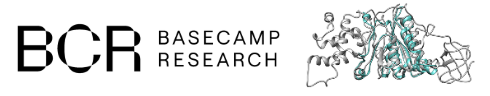

# HiFi-NN: Hierarchically fine-tuned nearest neighbours for EC number annotation
[](https://doi.org/10.5281/zenodo.15013616)

This tool serves as a method by which a query sequence(s) can be compared to a set of protein sequence embeddings to find those most similar to each query. It is assumed that distances encoded in the space represented by the reference embeddings are meaningful representations of protein similarity. To this end we provide a model which has been trained using contrastive learning to map ESM-2 embeddings to a new space which accurately refelcts the distances between proteins which contain similar annotations.

# Contents
- [Setup](#setup)
- [Inference](#inference)
- [Docker Usage](#docker-usage)
- [Creating an index](#creating-an-index)
- [Training](#training)

# Setup
### Installation
Clone this repository `git clone https://github.com/Basecamp-Research/HiFi-NN.git` and install the requirements from the `requirements.yaml` file.
```
conda env create -f requirements.yaml
```
### Requirements
If a FASTA file of sequences are used as the queries then ESM also needs to be installed into this directory as it is used to generate embeddings of these sequences.

```
git clone https://github.com/facebookresearch/esm.git
cd esm
pip install .
cd ../
```

### Downloading requisite files
The files necessary to run HiFi-NN can be downloaded from the following url:
`wget https://zenodo.org/records/15013616/files/ModelData.zip`

# Inference
There are three possible modes for inference.
1. From a single sequence, just enter the sequence as the value for `input` in the `annotate.yaml` config.
2. From a FASTA file, enter the path to the FASTA as the value for `input` in the `annotate.yaml` config.
3. From a folder of embeddings, enter the path to the folder as the value for `input` in the `annotate.yaml` config.

Then run:
```
python annotate.py
```

The default setttings for the above command will transfer the annotations of the _k_ nearest neighbours to query protein(s) along with an associated confidence score and minimum distance to each EC. There are three alternative options for the format in which the _k_ nearest neighbours can be used to annotate a particular protein sequence:
- _return distance_ = True, _return confidence_ = False:
  - This will annotate each query sequence with the EC numbers contained in its _k_ nearest neighbours and the minimum distance amongst these neighbours to each unique EC number. 

- _return distance_ = False, _return confidence_ = True:
  - This will annotate each query sequence with the EC numbers contained in its _k_ nearest neighbours and the confidence score associated with each EC. 

- _return distance_ = False, _return confidence_ = False:
  - This will annotate each query sequence with the _ids_ of its _k_ nearest neighbours.

# Docker Usage
### Building the Docker image
First, build the Docker image:
```
docker build -t hifinn .
```

### Running with Docker
Before running the Docker container, you need to download the ModelData locally:
```
wget https://zenodo.org/records/15013616/files/ModelData.zip
unzip ModelData.zip
```

Then run the container with mounted volumes:
```
docker run -v $(pwd)/ModelData:/app/ModelData -v $(pwd):/app/output --shm-size '2gb' hifinn
```
PyTorch will share data between processes using shared memory. Therefore if multiprocessing is used to load data then the shared memory segment size used by the container may not be enough. In the above example we increase the default from 64mb to 2gb. 
This will:
- Mount your local ModelData folder to `/app/ModelData` in the container, we will also save the models predictions here
- The annotations will be saved as, for illustration purposes `cluster30_annos.json`, in ModelData

# Creating an index
We can construct a FAISS index from a folder of ESM embeddings or a FASTA file by simply running the following script.  The index created can then later be used for annotation, as outlined above. 
```
python make_db.py
```
If you only wish to index a subset of a folder of embeddings you can specify the specific ids you wish to index, this is the last argument in the above command and is entirely optional. There are three accepted filetypes for these ids:
- `FASTA` file of sequences where the id indicates the filename of the embeddings you wish to index.
- `JSON` file with a list of the ids you wish to embed.
- `TXT` file with a single id per line.

# Training
### Embed training set
To embed your training set using ESM-2 you should run the following command (source: https://github.com/facebookresearch/esm/blob/main/README.md).
```
python scripts/extract.py esm2_t33_650M_UR50D examples/data/some_proteins.fasta \
  examples/data/some_proteins_emb_esm2 --repr_layers 32 --include per_tok
```

To train a model we simply run `python train_overlap_loss.py`. The config file in `configs/overlap_loss_config.yaml` should be adjusted accordingly to reflect the path's on your own machine.
